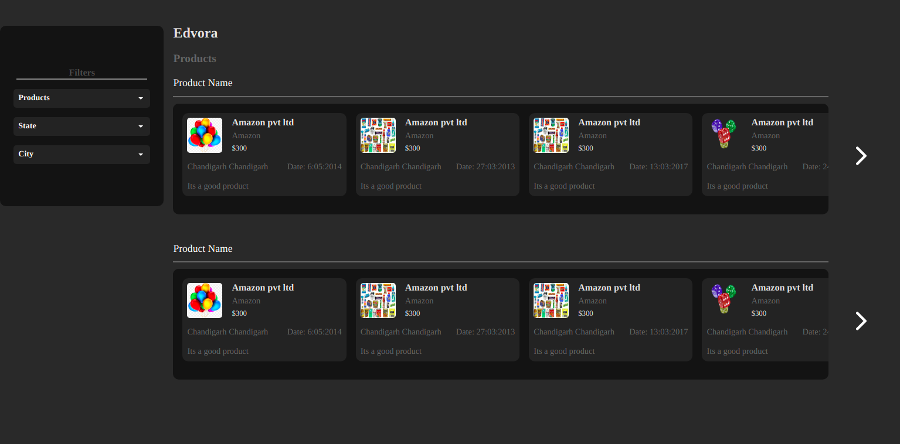

# Edvora

> Edvora take home application



This app does the following:

- Fetches data directly from the api
- Gets updated data for product names, brand names, prices, and more

## Built With

- Major languages: React, Sass
- Technologies: Webpacker, Hooks,

## Live Demo

[Live Demo Link](https://edvora-takehome.vercel.app/)

## Getting Started\*

To get a local copy up and running follow these simple example steps.

### Install

You can download the code to your personal computer clonig the repository using the following command

```
git clone

```

You will also have to checkout to the homepage branch and use the command `git pull` to get the lastest code.

You also need to use the command `npm install` to install all packages from the project.

### Usage

- Open the `index.html` file inside the `dist` folder using your browser of choice.
- Or you can simple run `yarn run start` or `npm run start` on the terminal to load the project on your default browser on port:8080

## 🤝 Contributing

Contributions, issues, and feature requests are welcome!

Feel free to check the [issues page]().

## Show your support

Give a ⭐️ if you like this project!
